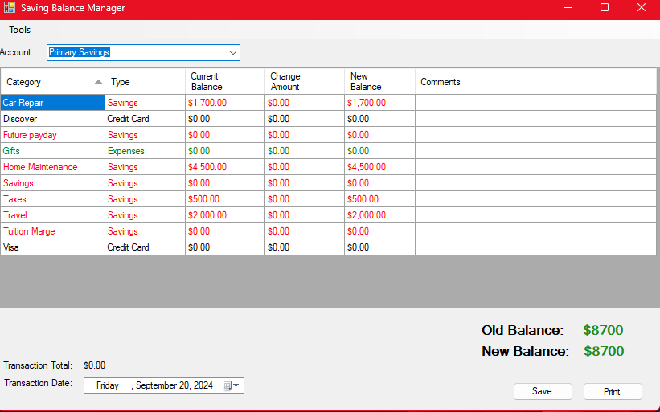

# Sinking Funds Manager

Many times in managing a houshold budget.  Sinkng funds are used for intermittent or future expenses.  A could description can be found [here](https://www.ramseysolutions.com/saving/stop-the-panic-sinking-fund#:~:text=A%20sinking%20fund%20is%20a,use%20at%20a%20later%20date).

The challenge of implementing a sinking fund is that a savings account may be used for multiple purposes: college savings, savings for a future vacation, household maintenance, intermittent auto repairs etc.

This application was created to allow tracking of the various buckets of funds withing a savings account.

## Features
 - Support for multiple savings accounts with distinct category lists in each account
 - Customizable category lists
 - Grouping and color coding of categories

 

 Note: This was created for personal use, so the feature set is rudimentary.  For example, 
 - to customize the accounts and categories, you must edit text files outside of the program.  
 - there is no customization of where you store data
 - data is stored in a simple CSV format

## Setup

## Use

### Entering Transactions

### Sorting

### Data Location

## Contributing

## To Do